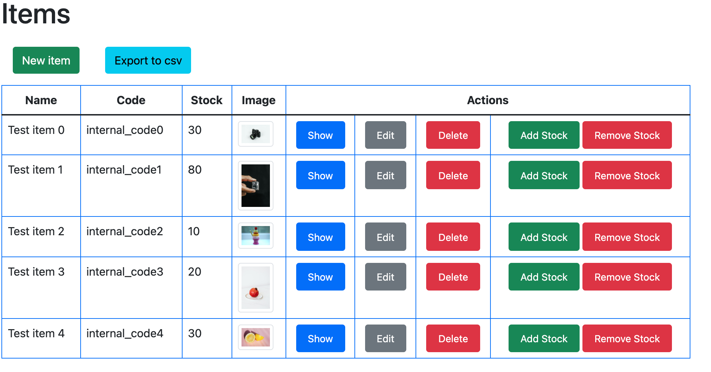
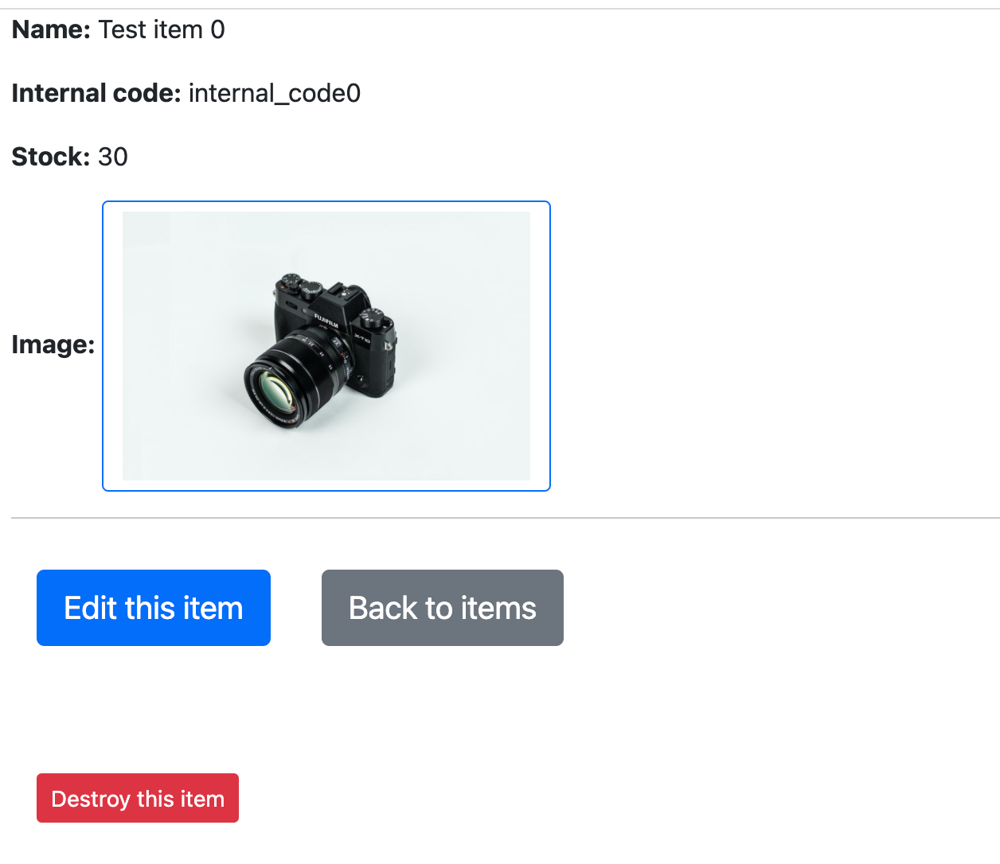

## Project: Inventory tracking web application for a logistics company

## Features

- This app is for having a tracking of all products inventory for a logistics company
- The app lets you add and manage products, including a picture for each of them. This is known as CRUD (Create, Read, Update, Destroy)
- You can simulate adding and removing stock


- Extra feature added: You can export the inventory to a csv file


## Screenshots

List page:


Signup page:



## Built With

- Ruby 3.0.3
- Rails 7.0.1

## Live Demo

Visit the [Group my activities](https://peaceful-chamber-68618.herokuapp.com/) webapp to test my app

## Prerequisites
- Ruby 3.0.3 [(Installation steps)](https://www.ruby-lang.org/en/documentation/installation/) 
- Rails 7.0.1 [(Installation steps)](https://guides.rubyonrails.org/v5.0/getting_started.html#installing-rails)
- Postgres: >=9.5 [(Download link)](https://www.postgresql.org/download/)

## Getting Started

- Open your terminal - Windows: `Win + R`, then type `cmd` | Mac: `Command + space`, then type `Terminal`
- Navigate to a directory of your choosing using the `cd` command
- Run this command in your OS terminal: `git clone git@github.com:MiguelArgentina/inventory-challlenge-shopify.git` to get a copy of the project.
- Navigate to the project's directory using the `cd` command
- Install gems with: `bundle install` 
- Setup database with:

```
   rails db:create
   rails db:migrate
   rails db:seed
```

### Usage

Start server with:

```
    rails server
```

Open `http://localhost:3000/` in your browser.

## Author


### Miguel Gomez


* GitHub: [@MiguelArgentina](https://github.com/MiguelArgentina)
* twitter - https://twitter.com/Qete_arg

### 🤝 Contributing

Contributions, issues, and feature requests are welcome!

Feel free to check the [issues page](https://github.com/MiguelArgentina/inventory-challlenge-shopify/issues).

### Show your support

Give a ⭐️ if you like this project!

### 📝 License

This project is [MIT](LICENSE) licensed.